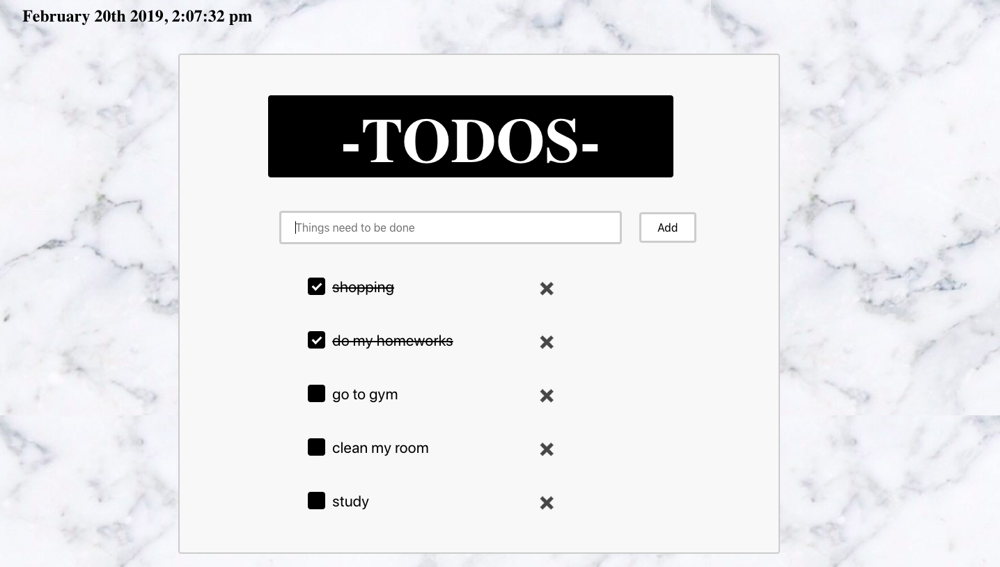

# To Do List React App

 
      

# About the project:

Create to-do list online to keep your tasks organized. 

# Features Included:
- Add a new item to the list
- Mark the item as complete
- Remove an item from the list
- Use a 3rd party library (moment)

# Difficulties:
- difficulites with removeList function() it was removing the elements randomly!
- tried to make the app responsive but it dose not worked correctly.

# Favourite working part:
- work on the CSS 
- practicing react native app

# Future development planning:
#- add features:
- Make To Do List responsive
- Clear all items
- Clear only completed items
- Save data to localstorage or API
- Use 3rd party API with Axios

# Approach:
- created state object that includes formData that user inputs
- created an empty array that will take formData
- UpdateForm function() that will make a copy Object of the formData to be used over   again
- AddList function() to add user input to the empty array
- removeList function() to removes each cheked element by it's index
- checkBox function () will make the checked element text line through

# Unsolved problems:
- clicked add button will added an empty element
      
# Acknowledgements:

I give a big thanks to the amazing instructors,
@MicFin
@Ghadeer
they helped me a lot,
I appreciate their hard work with me.

